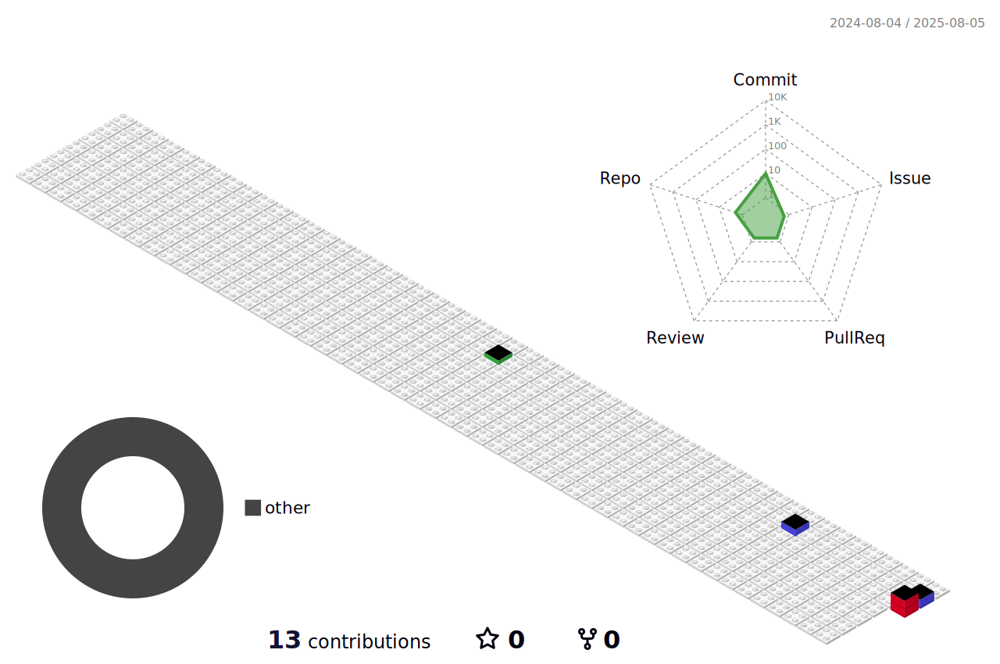

<h1 align="center">André Dias</h1>

  Estudante📚

---

---

## Sobre

- Atuação em desenvolvimento full stack com JavaScript e TypeScript
- Professor de Tecnologia no SENAI e SENAC; criador do canal Professor Corrêa
- Especialista em acessibilidade, UI/UX, clean code e liderança de produtos digitais
- Pós-graduação em Engenharia de Software e Digital Product Leadership
- Experiência em automação de processos e integração de sistemas utilizando Python

## Contato

- [LinkedIn](https://www.linkedin.com/in/andrediass/)
- [Instagram](https://www.instagram.com/)

---

> Educar é tornar o saber algo com voz, sentido e sentimento.
